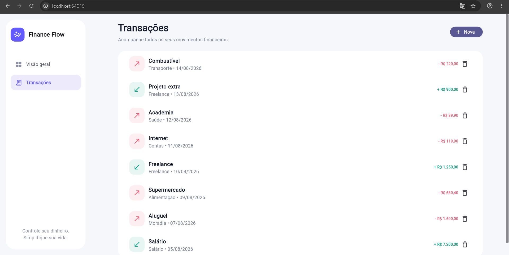
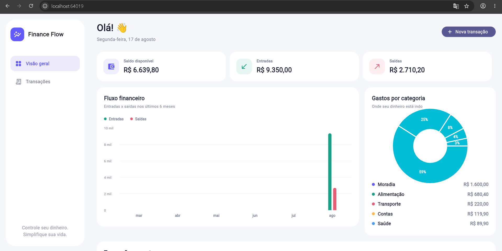
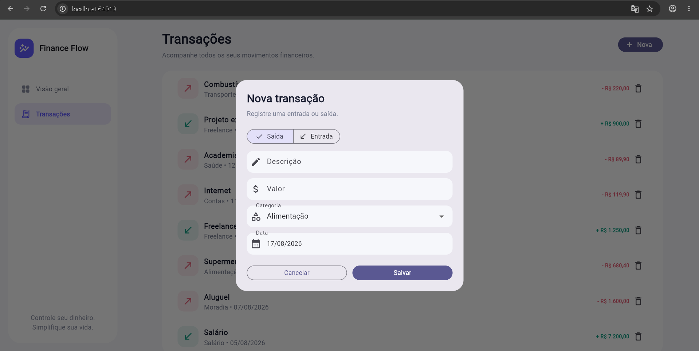
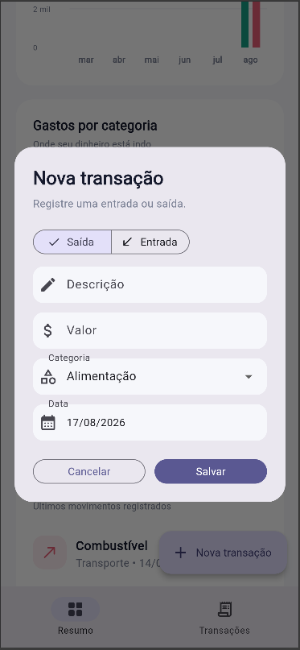
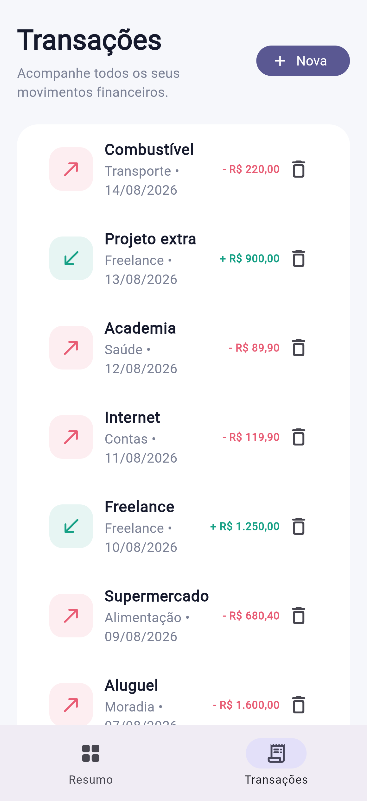

# Finance Flow

Sistema de gestão financeira pessoal desenvolvido com Flutter e Dart, com interface moderna, responsiva e adaptada para diferentes plataformas.

O projeto foi desenvolvido com foco em organização de código, separação de responsabilidades, reutilização de componentes, experiência do usuário e aplicação de boas práticas de desenvolvimento.

## Telas

### Dashboard Desktop

<p align="center">
  
</p>

### Fluxo Financeiro Desktop

<p align="center">
  
</p>

### Transações Desktop

<p align="center">
  
</p>

### Dashboard Mobile

<p align="center">
  
</p>

### Nova Transação Mobile

<p align="center">
  
</p>

### Transações Mobile

<p align="center">
  
</p>

## Funcionalidades

- Dashboard financeiro
- Controle de entradas e saídas
- Visualização do saldo atual
- Resumo financeiro
- Gráficos financeiros com animações
- Fluxo financeiro dos últimos meses
- Visualização de receitas e despesas
- Controle e cadastro de transações (inclusão e exclusão)
- Categorias financeiras e seleção de datas
- Formatação de valores em moeda brasileira
- Interface responsiva com layouts específicos para desktop e mobile
- Componentes reutilizáveis
- Tema baseado no Material 3

## Arquitetura

O projeto utiliza **Clean Architecture** para separar as responsabilidades da aplicação e facilitar sua manutenção, evolução e testabilidade.

```text
lib/
├── core/
│   └── theme/
│
├── data/
│   ├── datasources/
│   └── repositories/
│
├── domain/
│   ├── entities/
│   ├── repositories/
│   └── usecases/
│
├── presentation/
│   ├── bloc/
│   ├── pages/
│   └── widgets/
│
└── main.dart
```
